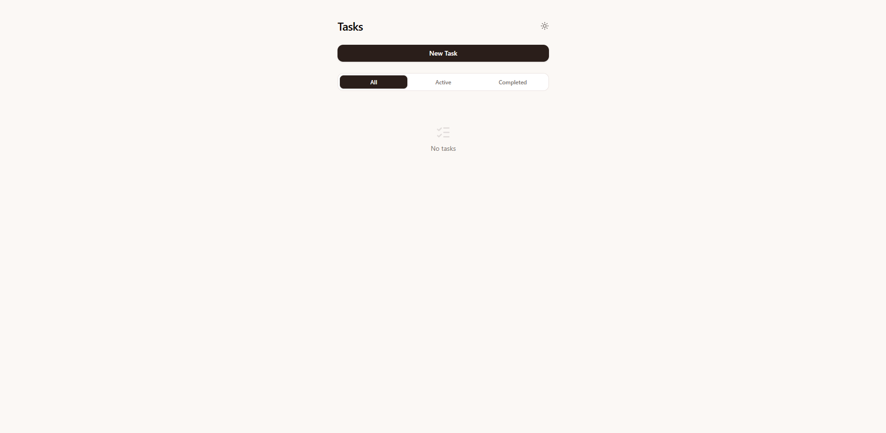
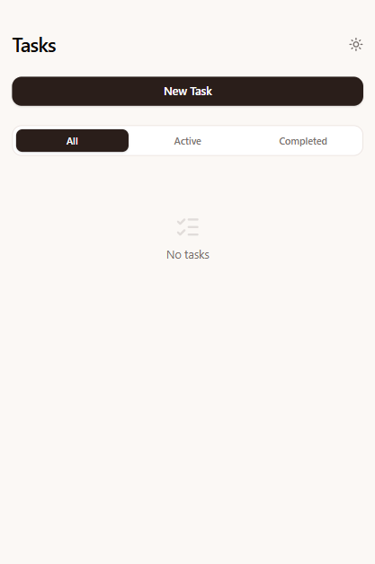

# ✅ To-Do App

Uma aplicação web moderna de **gestão de tarefas**, focada em simplicidade, fluidez e uma experiência de utilizador agradável. Permite criar, concluir e remover tarefas de forma intuitiva, com um design minimalista e animações suaves.

---

## 🎯 Funcionalidades

- ➕ Adicionar novas tarefas através de um modal
- ✅ Marcar tarefas como concluídas (checkbox)
- 🗑️ Remover tarefas
- 🕒 Definir data e hora (opcional) para cada tarefa
- 🌙 Alternar entre modo claro e escuro
- ✨ Animações suaves com transições (Framer Motion)
- 📭 Estado vazio com feedback visual quando não existem tarefas

---

## 🛠️ Tecnologias Utilizadas

Este projeto foi desenvolvido com:

- **Framework:** React
- **Linguagem:** TypeScript
- **Estilização:** Tailwind CSS
- **Animações:** Framer Motion
- **Ícones:** Lucide React

---

## 📂 Estrutura do Projeto

```text
/to-do-app
  /public            # Assets estáticos

  /src               # Pasta principal
    /components         # Componentes reutilizáveis
    /hooks              # Hooks personalizados
    /types              # Tipos personalizados

    App.tsx             # Componente principal


```

---

## 🚀 Demo Online

🔗 https://to-do-app-phi-sandy.vercel.app

---

## 📸 Screenshots





---

## ⚙️ Como Executar o Projeto

### Pré-requisitos

- Node.js (v18 ou superior)
- npm ou yarn

### Clonar o repositório

```bash
git clone https://github.com/USERNAME/to-do-app.git
cd todo-app
```

### Instalar dependências

```bash
npm install
```

### Executar em modo de desenvolvimento

```bash
npm run dev
```

---

## 📚 O Que Aprendi

Durante o desenvolvimento deste projeto, foram reforçados conhecimentos em:

- Gestão de estado em React com hooks personalizados
- Separação de lógica e UI (custom hooks)
- Criação de interfaces interativas e responsivas
- Implementação de animações com Framer Motion
- Boas práticas de UX (modais, empty states, feedback visual)

---

## 👨‍💻 Autor

Desenvolvido por Daniel Fernandes

GitHub: https://github.com/DannySF01
LinkedIn: https://linkedin.com/in/daniel-f-874186115

---

## 📝 Licença

Este projeto foi desenvolvido exclusivamente para fins educativos.
