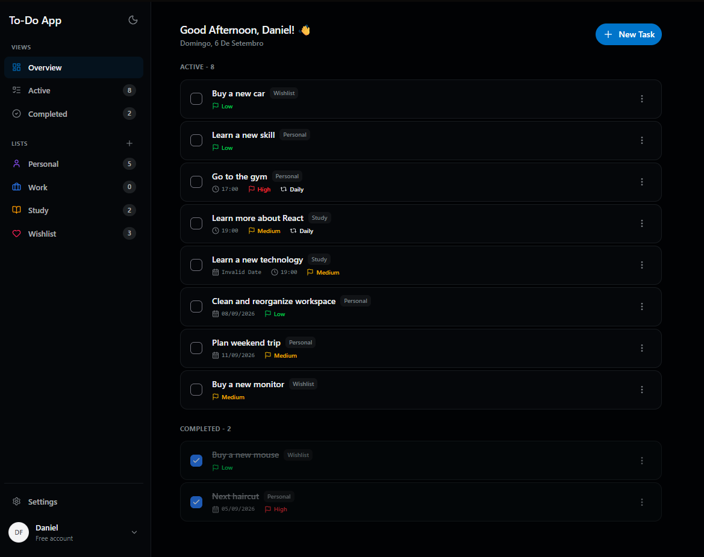
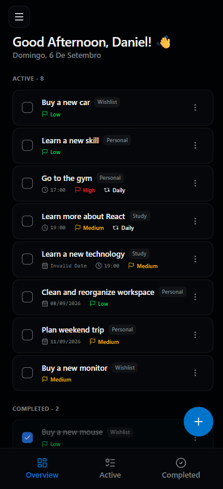

# ✅ To-Do App

A modern and responsive task management web application designed to keep everyday tasks organized through a clean, intuitive, and fluid user experience.

The application allows users to create, organize, filter, and manage tasks while providing a minimalist interface with smooth animations and responsive layouts across desktop and mobile devices.

---

## 🎯 Features

- ➕ Create tasks through an intuitive modal
- ✏️ Task details including title, description, date, and time
- ✅ Mark tasks as completed
- 🗑️ Delete tasks
- 📋 Create and manage task lists
- 🚩 Set task priorities
- 🔎 Filter and organize tasks
- 🔄 Create recurring tasks
- 🔔 Configure task reminders
- 📅 Set optional due dates
- 🌙 Light and dark mode
- 📱 Responsive design for desktop, tablet, and mobile
- ✨ Smooth UI animations and transitions
- 📲 Progressive Web App (PWA) support

---

## 🛠️ Technologies

This project was built using the following technologies:

- **Framework:** React
- **Language:** TypeScript
- **Styling:** Tailwind CSS
- **Animation:** Framer Motion
- **Icons:** Lucide React
- **Deployment:** Vercel

---

## 📂 Project Structure

```text
/to-do-app
  /public
  └── /screenshots              # Application screenshots

  /src
  ├── /components               # Reusable UI components
  ├── /hooks                    # Custom React hooks
  ├── /types                    # Type definitions
  ├── App.tsx                   # Main application component
  ├── main.tsx                  # Entry point of the application

  /index.html                   # HTML template
  /README.md                    # Project documentation
  /package.json                 # Project configuration
  /tsconfig.json                # TypeScript configuration
  /vite.config.ts               # Vite configuration


```

---

## 🚀 Live Demo

🔗 https://to-do-app-phi-sandy.vercel.app

---

## 📸 Screenshots





---

## ⚙️ Getting Started

### Prerequisites

- Node.js (v18 or higher)
- npm or yarn
- git

### Clone the repository

```bash
git clone https://github.com/DannySF01/to-do-app.git
cd todo-app
```

### Install dependencies

```bash
npm install
```

### Run the development server

```bash
npm run dev
```

---

## 🧠 What I Learned

Developing this project helped strengthen my understanding of:

- React state management with hooks
- Building reusable and modular components
- Creating custom React hooks
- Implementing responsive design
- Using Framer Motion for smooth UI animations
- Deploying a Progressive Web App (PWA)
- Improving UI/UX design through responsive layouts

---

## 🔮 Future Improvements

- Add authentication
- Integrate with backend APIs for data persistence
- Improve accessibility even further
- Optimize performance
- Improve UI/UX even further
- Handle errors and edge cases
- Push Notifications

---

## 👨‍💻 Author

Developed by Daniel Fernandes

GitHub: https://github.com/DannySF01
LinkedIn: https://linkedin.com/in/daniel-f-874186115

---

## 📝 License

This project was developed for educational purposes.
